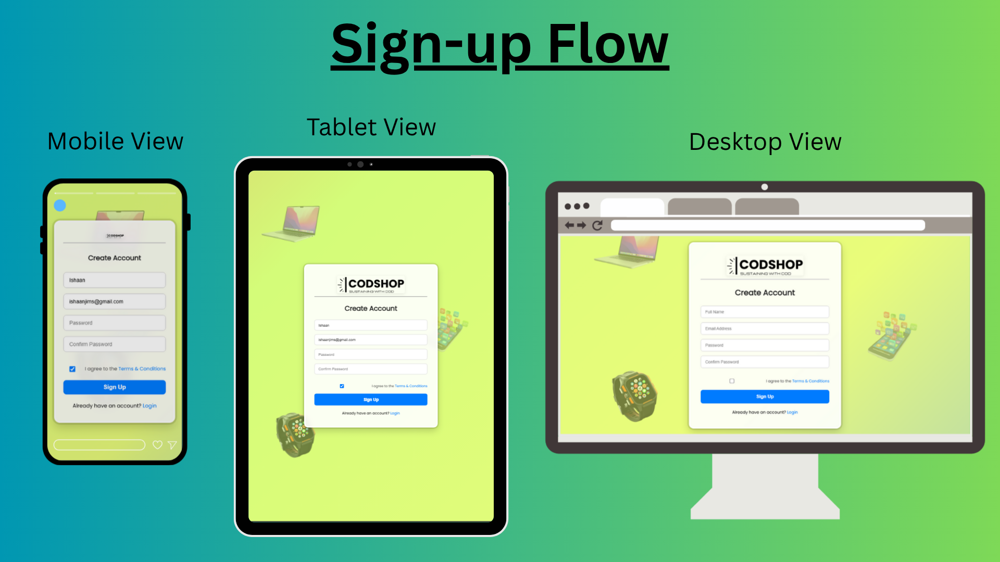

**CodSoft UI/UX Internship**
# Task 1 – Signup Page UI Design
Designed by: *Ishaan*

This project is created as part of the **CodSoft UI/UX Design Internship**. It features a modern, animated signup form with a responsive layout, gradient background, and floating device illustrations to create a visually engaging user experience.

## 📸 Preview Screenshot

> Here's a screenshot of the final email layout in the browser:

---

## ✨ Features

- 📱 Responsive signup form (Full Name, Email, Password)
- ✅ Checkbox for Terms & Conditions (cleanly aligned)
- 🎨 Animated multi-color gradient background
- 💻 Floating icons of smart devices (laptop, mobile, tablet)
- 🧊 Glass-effect form container with visible border
- 💡 Modern fonts, subtle shadows, smooth hover transitions
- 🔒 Built using HTML5 + CSS3 + JS only (No backend)

---

## 📁 Folder Structure

task-1-signup-flow/
├── signup.html
├── login.html
├── style.css
├── CODSHOP logo.png
├── laptop.png
├── mobile.png
├── watch.png
├── preview.png
└── README.md

---

## 🚀 How to Run

1. Download or clone this repository.
2. Place all images (logo & floating icons) in the same folder as your `singup.html`.
3. Open `signup.html` in any modern browser (Chrome, Edge, Firefox).
4. Enjoy the responsive, animated signup UI.

---

## 📌 Internship Task Info

- **Task:** Signup Page UI
- **Internship:** CodSoft – UI/UX Designer
- **Technology Used:** HTML, CSS
- **Status:** ✅ Completed

---

## ⚠️ Note on Functionality

> This is a **frontend UI-only** project. It does not store or submit form data.  
> Security, validation, and backend logic are **not implemented**, as this is focused on **UI/UX design principles**.

---

## 🧠 About Me

**👋 Hi, I'm Ishaan**, a BCA student studying at Jagannath International Managment School, Vasant Kunj, Delhi.
This project is part of my practical work for the CodSoft Internship.

Feel free to connect or provide feedback!

---